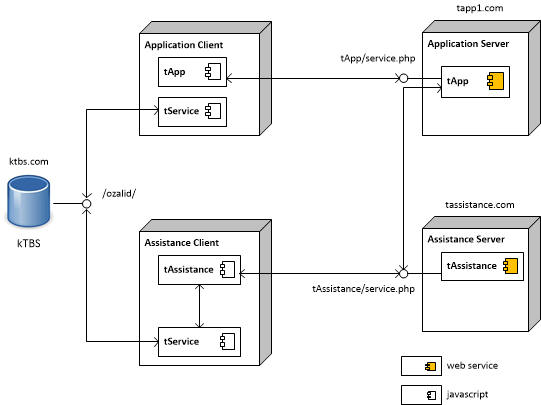

TConnect
========

a platform for collecting, visualizing traces 

Introduction
------------

TConnect is a web based platform for connecting the trace based applications as end-user web application, user assistance system and trace base management system. 
For facilitating the developement, TConnect is organized into modules specialized for different types of systems.  

* tService: API for storing and accessing modelled traces in JavaScript. 
See also [tService JS API](https://rawgithub.com/ahle/tconnect/master/doc/js-api/index_tservice.html)
* tApp: API for non-trace requests needed to maintain the connection between the end-user application and the other systems.
See also [tApp REST API](https://rawgithub.com/ahle/tconnect/master/doc/rest-api/index_tapp.html),
[tApp JS API](https://rawgithub.com/ahle/tconnect/master/doc/js-api/index_tapp.html)
* tAssistance: API for high-level requests on traces (transformation, visualisation, analyse, mining).
See also [tAssistance REST API](https://rawgithub.com/ahle/tconnect/master/doc/rest-api/index.html)
and [tAssistance JS API](https://rawgithub.com/ahle/tconnect/master/doc/js-api/index_tassistance.html)
* tLearning: API for trace based reasoning

The figure below is an example of using TConnect in order to build a user assistance system. 
To build a such system, see the tutorial [Install TConnect](doc/tut_setup.md)

Requirements
------------

For kTBS : 
* See also the tutorial [Installing kTBS ](https://kernel-for-trace-based-systems.readthedocs.org/en/latest/tutorials/install.html)

For end-user application : 
* Apache 2.2.17 or later [Installing Apache 2](http://httpd.apache.org/download.cgi)
* PHP 5.3.5 [Download PHP 5.3](http://php.net/downloads.php)

For user assistance website :
* Apache 2.2.17 or later [Installing Apache 2](http://httpd.apache.org/download.cgi)
* PHP 5.3.5 [Download PHP 5.3](http://php.net/downloads.php)
* MongoDB

Documents
--------

Online Demo
----
http://88.191.236.98/tconnect/tAssistance/index.php?page=Main 

(This version is hosted on a personal server. The service could be temporarily unavailable)

Authors
-------
-  [Anh-Hoang Le](https://github.com/ahle)

