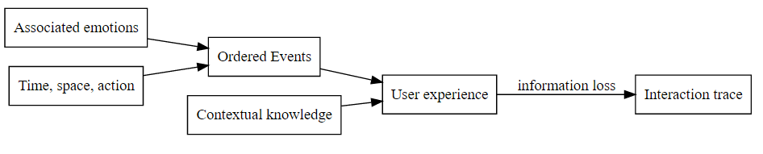

## Task & Goal

This section, we describe the laws on the task and goal space.

We distinct the notions as task model, goal model and UI model.

There are some researchs on UX design, these research aimed to design a good interface for users based on user experience elements as user needs,etc...
Almost these methods based on UX analysis when interact with the UI and the output of the process is the UI design enhancement.

Our research based on two steps, reconstruct the episodic memory of user based on interaction traces and suggest the user an automated task which could help the users fill the gaps between him and other users in the platform.

##### Reconstruct UX based on interaction trace

Source: [UX](http://www.usabilis.com/definition-ux-experience-utilisateur-user-experience/)

> Episodic memory represents our memory of experiences and specific events in time in a serial form, from which we can reconstruct the 
> actual events that took place at any given point in our lives. 
> It is the memory of autobiographical events (times, places, associated emotions and other contextual knowledge) that can be explicitly 
> stated.
> Individuals tend to see themselves as actors in these events, and the emotional charge and the entire context surrounding an event is 
> usually part of the memory, not just the bare facts of the event itself.'
--  Human episodic memory

*User experience in episodic memory tracked in interaction trace*

A full user experience included times, places, associated emotions and other contextual knowledge is stored in episodic memory.
By this, the user could reconstruct the experience in the past to help the actual context. 

Todo that, the first step, we analyse X interaction traces, almost them have no associated emotions in trace.

