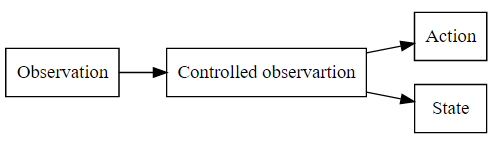

# Part VI: Trace

In this section, we describe about the elements in trace theory and discuss about the information levels of a primary trace.

A trace T is defined as a set of observed elements (obsels).
An obsel ot, produced by an observation about the enviroment, represents the information of the observation ot = (x1, x2, ..., xn|x ∈ X), where X is all observable attributes of the enviroment.

#### Observation
I listed here some definitions about the human observations:

In dictionary.com, "observation is an act or instance of regarding attentively or watching" [2].
"The something that is learned in the course of observing things i.e. my observation is that such clouds mean a storm." [4]

*Observation* in is the process of filtering sensory information through the thought process.
Input is received via hearing, sight, smell, taste, or touch and then analyzed through either rational or irrational thought. 

*Observation* pertains to physical seesing process by which a living being sense its surrounding popularlly known as environment.
So in this way, observation is a process of getting aware about your environment through various sensory organs (visual, auditory, gustatory, olfactory, cutaneous, kinesthetic, vestibular).

In psychology, there are three observational methods:
- Controlled observation
- Natural observation
- Participant observation

In CTM Method, an observed element contains a set of property values, in which they represent the properties of the environment state, the action, or the objects

Read more about CTM method.

[Observation methods](https://www.simplypsychology.org/observation.html)

fffff[^fn3]

[^fn1]: So Chris Krycho, "Not Exactly a Millennium," chriskrycho.com, July 22,
    2015, http://www.chriskrycho.com/2015/not-exactly-a-millennium.html
    (accessed July 25, 2015)

##### Perception
Observation is more or less physical process.
On the other hand, perception is the process of adding meaning to stimuli (Event)

As Rubin's vase example, we understand better the processes of human perception.
The first process is stimuli selection.
When we attend to or select one specific thing in our environment, it becomes the attendted stimulus.
Organisation of stimuli happens by way of neural processes;
After we receive and organize stimuli, we can interpret those stimuli, which simply means that we take the information and turn it into something that we can categorize.

[Introduction to perception](https://www.boundless.com/psychology/textbooks/boundless-psychology-textbook/sensation-and-perception-5/introduction-to-perception-39/introducing-the-perception-process-167-12702/)

#### Human perception vs [Machine Perception](https://en.wikipedia.org/wiki/Machine_perception)

Machine perception is the capability of a computer system to interpret data in a manner that is similar to the way humans use their senses to relate to the world around them.

As all of other recognization system, the first result of interpret trace of the assistance system is not perfect.
It requires the correction by the user who generated his/her trace.

We called this process as the calibration or perception matching.
In Tconnect, we use the accept reject method for calibration.

Citation references, like [CIT2002]_.
Note that citations may get
rearranged, e.g., to the bottom of
the "page".

.. [CIT2002] A citation
   (as often used in journals).

Citation labels contain alphanumerics,
underlines, hyphens and fullstops.
Case is not significant.

Given a citation like [this]_, one
can also refer to it like this_.

.. [this] here.

