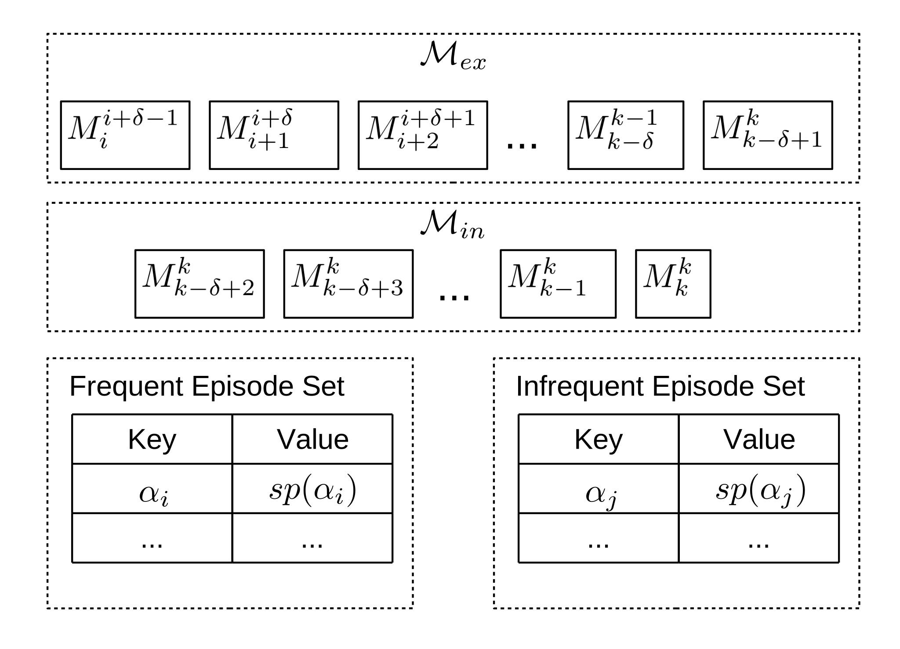

## Episode in Trace
<!-- Introcduction -->
This section provides an overview of the definitions and properties about episode mining.

### Episode
In data mining, an **episode** (also known as serial episode) is usually defined as a totally ordered set of events, and the frequency of an episode is the measure of how often it occurs in a sequence.

*Frequent episode mining (FEM)* techniques are broadly conducted to analyze data sequences in the domains of telecommunication, manufacturing, finance, biology, system log analysis and new analysis.
*FEM* aims at identifying all the frequent episodes whose frequencies are larger than a user-specified threshold.

Let's talk with an example with an event sequence of alarm systems:

 Fig. 1. A sequence of events 

One basic problem in analyzing event sequences is to find frequent episodes, i.e. a collection of events occuring frequently together.
When discovering episodes in a telecommunication network alarm log, the *goal* is to find relationships between alarms.
Such relationships can then be used in the on-line analysis of the incoming alarm stream, e.g., to better explain the problems that cause alarms, to suppress redundant alarms, and to predict servere faults.

### State-of-the-art
We are not aware of prior work on the problem of online *infrequent episode* mining. However, there are several studies related to this task, including frequent episode mining and online frequent pattern mining.

### Episode Trie
In [CTM](7.CTM.md) method, we use the an **episode trie** to identifying all the new minimal episode occurences.

Firstly, we  give the description of the data structure, which stores all minimal occurences in $M_i^j$. Remind that $M_i^j$ is the set of all minimal episode occurrences, starting at time $t_i$ and ending no later than $t_j$.

A *episode trie* has the structure as following:

A **trie**, also called *prefix tree*, is an ordered tree data structure that is used to store a dynamic set where the keys are usually strings.
In a trie, all the descendants of a node have a common prefix of the string associated with that node, and the root is associated with the empty string.

<!-- digraph G {
  "root:5" -> "A:5"
  "A:5" -> "A:6"
  "A:5" -> "B:6"
  "A:6" -> "B:7"
  "B:6" -> "B:7 "
} -->

 Fig. 2. An example of episode trie 

**Definition (Episode Trie)**
Given a time-window $[t_i, t_j]$, an episode trie (E-trie for short, denoted $\mathcal{T}_i^j$) is a trie-like structure defined below.

1) Each node $p$, denoted by $p.event:p.time$, consists of two fields: $p.event$ and $p.time$. Here, $p.event$ registers which event this node represents, and $p.time$ registers the occurence time stamp of such event.

2) The event field of the root is associated with the empty string (labeled as "root"), and the *time* field of the root is equal to its content, and its occurrence window is $[t_i, p.time]$.

For example, Figure 2 shows the episode trie $\mathcal{T}_5^7$) to store all the elements in $M_5^7$ for the running example in Figure 1.

It contains 5 minimal episode occurrences.
More importantly, each element in $M_5^7$ corresponds to a node in (except the root) in $\mathcal{T}_5^7$.
For example, the occurrence of ($A \rightarrow A \rightarrow B$)

#### Last Episode occurrence

Next, we introduce another important definition, the last episode occurrence, which is the key concept to the proposed online algorithm.

**Definition (The last episode occurrence)**
Given a time window $[t_i,t_j]$, an episode occurrence $(\alpha, [t_1,t_2])$ is the last episode occurrence of $\alpha$ within this time window if and only if there does not exist another occurrence of $(\alpha, [t'_1,t'_2]) (t'_i \leq t'_1 \leq t'_2 \leq t'_j)$ such that $t'_1 > t_1$.
The set of all the last episode occurrences within the time window of $[t_i,t_j]$ is denoted by $L_i^j$.

With the definition of the last episode occurrence, the set of $M_j^k$ can be divided into two parts.
Namely, considering the time window of $[k - \sigma + 1, k]$ can be represented as

<!-- $M_j^k = \left\{                \begin{array}{ll}                  S_j^k = M_j^k \cap L_{k-\sigma+1}^k\\
                  \overline{S_j^k} = M_j^k - S_j^k
                \end{array}
              \right.$ -->

Clearly, all the elements in $S_j^k$ are the last minimal occurrences within the time window of $[k-\sigma +1, k]$. However, the elements in $\overline{S_j^k}$ are just the minimal occurrences, but not the last ones.

<!-- The whole framework in our approach, where $i = max(1, k - \Delta + 1)$. -->

**The Storage Framework**
  For the batch mode of frequent episode mining, all solutions remove infrequent events by scanning the whole sequence in the first round, and then the mining process performs in the space of frequent events.
  This preprocessing step greatly reduces the observed element space and thus saves much memory consumption.
  However, in the online mode of trace model we cannot apply such pre-processing since an infrequent event in the current sequence may become frequent episode in the future.
  Thus, the mining process can only be conducted in the original event space, which may lead to a sharp increase of memory consumption for storing all minimal knowledge occurrences.
  To tackle this challenge, we propose a storage management framework, as shown in Fig. 3.

In Fig. 3, all elements in $$\mathcal{M}_{in}$$ and $$\mathcal{M}_{ex}$$ are stored by chronological orders.
Since, the $\delta - 1$ elements in $\mathcal{M}_{in}$ will be updated with the new coming events, $\mathcal{M}_{in}$ can always stay in the main memory. (Note that $\delta$ usually is a small number).
For the other part $\mathcal{M}_{ex}$, since the new coming events do not affect any elements in $\mathcal{M}_{ex}$, we can save the $k-\delta+1$ elements into the external storage when k is very large.

There are still two simple structures stored in the framework, namely *frequent episode set* and *infrequent episode set*.
Both of them are tables of which they key records the name of episodes and the value records the support count of the corresponding episode.

 Fig. 3. The storage framework in our approach.

$$\usetikzlibrary{decorations.pathmorphing}
\begin{tikzpicture}[line width=0.2mm,scale=1.0545]\small
\tikzset{>=stealth}
\tikzset{snake it/.style={->,semithick,
decoration={snake,amplitude=.3mm,segment length=2.5mm,post length=0.9mm},decorate}}
\def\h{3}
\def\d{0.2}
\def\ww{1.4}
\def\w{1+\ww}
\def\p{1.5}
\def\r{0.7}
\coordinate[label=below:$A_1$] (A1) at (\ww,\p);
\coordinate[label=above:$B_1$] (B1) at (\ww,\p+\h);
\coordinate[label=below:$A_2$] (A2) at (\w,\p);
\coordinate[label=above:$B_2$] (B2) at (\w,\p+\h);
\coordinate[label=left:$C$] (C1) at (0,0);
\coordinate[label=left:$D$] (D) at (0,\h);
\draw[fill=blue!14](A2)--(B2)-- ++(\d,0)-- ++(0,-\h)--cycle;
\draw[gray,thin](C1)-- +(\w+\d,0);
\draw[dashed,gray,fill=blue!5](A1)-- (B1)-- ++(\d,0)-- ++(0,-\h)-- cycle;
\draw[dashed,line width=0.14mm](A1)--(C1)--(D)--(B1);
\draw[snake it](C1)--(A2) node[pos=0.6,below] {$c\Delta t$};
\draw[->,semithick](\ww,\p+0.44*\h)-- +(\w-\ww,0) node[pos=0.6,above] {$v\Delta t$};
\draw[snake it](D)--(B2);
\draw[thin](\r,0) arc (0:atan2(\p,\w):\r) node[midway,right,yshift=0.06cm] {$\theta$};
\draw[opacity=0](-0.40,-0.14)-- ++(0,5.06);
\end{tikzpicture}$$
