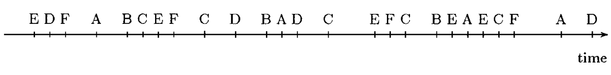

## Episode in Trace

In data mining, an **episode** (also known as serial episode) is usually defined as a totally ordered set of events, and the frequency of an episode is the measure of how often it occurs in a sequence. 

*Frequent episode mining (FEM)* techniques are broadly conducted to analyze data sequences in the domains of telecommunication, manufacturing, finance, biology, system log analysis and news analysis . 

FEM aims at identifying all the frequent episodes whose frequencies are larger than a user-specified threshold.

Let's talk with an example with an event sequence of alarm systems:

 An sequence of events 

One basic problem in analyzing event sequences is to find frequent episodes, i.e. a collection of events occuring frequently together.
